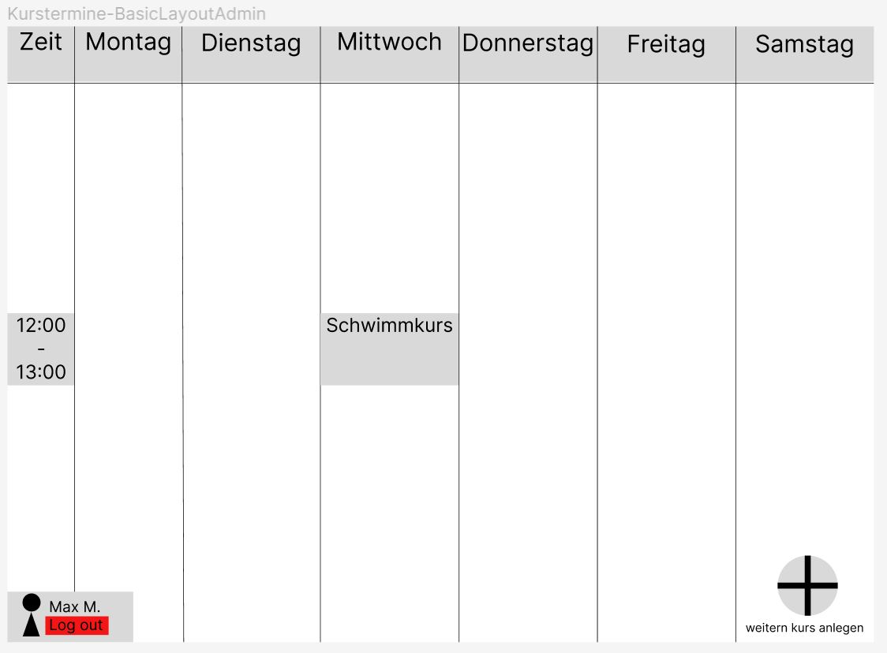

= Kurstermine

== Beschreibung
Da es seit einiger Zeit immer häufiger zu Ausfällen von einigen Personen bei den Kursen kommt, was letztendlich zu 
vergebenen, aber ungenutzten Plätzen führt, wird nun ein System gebraucht, welches den Kursteilnehmern die Möglichkeit 
bietet sich selbständig in Kurse einzutragen bzw. sich wieder auszutragen, wenn der Teilnehmer aus irgendeinem Grund zum
festgelegten Termin doch nicht erscheinen kann. So kann eine Person ohne Platz im Falle eines Ausfalls, sich noch in den
Kurs eintragen, um ihn wieder zu füllen.
  
== Links
https://github.com/2223-3bhif-syp/02-projekte-kurstermine/blob/main/asciidocs/index.adoc[Index]

https://github.com/2223-3bhif-syp/02-projekte-kurstermine/blob/main/asciidocs/projektauftrag.adoc[Projektauftrag]

https://github.com/2223-3bhif-syp/02-projekte-kurstermine/blob/main/asciidocs/sysspec.adoc[Pflichtenheft]

https://vm81.htl-leonding.ac.at/agiles/99-370/current[Product Backlog]

== Quickstart

=== Prequisites

[source, bash]
----
cd CourseSchedule/
----

==== Create Databse

[source, bash]
----
./derbydb-create.sh
----

=== Start Application

==== Start Backend

[source, bash]
----
./derbydb-start.sh
----

==== Start Frontend

[source, bash]
----
mvn clean javafx:run
----

== Wireframes

.Anmeldeseite
[%collapsible]
====
image:asciidocs/images/KurstermineLoginPage.jpg[]
====

.Registrierungsseite
[%collapsible]
====
image:asciidocs/images/KurstermineRegisterPage.jpg[]
====

.Admin-Ansicht - Basic
[%collapsible]
====

====

.Admin-Ansicht - Kurserstellung
[%collapsible]
====
image:asciidocs/images/KurstermineAdminKursansichtCreate.jpg[]
====

.Admin-Ansicht - Kursbearbeitung
[%collapsible]
====
image:asciidocs/images/KurstermineAdminKursansichtEdit.jpg[]
====

.User-Ansicht - Basic
[%collapsible]
====
image:asciidocs/images/KurstermineBasicLayoutUser.jpg[]
====

.User-Ansicht - Kursanmeldung
[%collapsible]
====
image:asciidocs/images/KurstermineUserKursansichtRegister.jpg[]
====

.User-Ansicht - Kursabmeldung
[%collapsible]
====
image:asciidocs/images/KurstermineUserKursansichtUnregister.jpg[]
====
