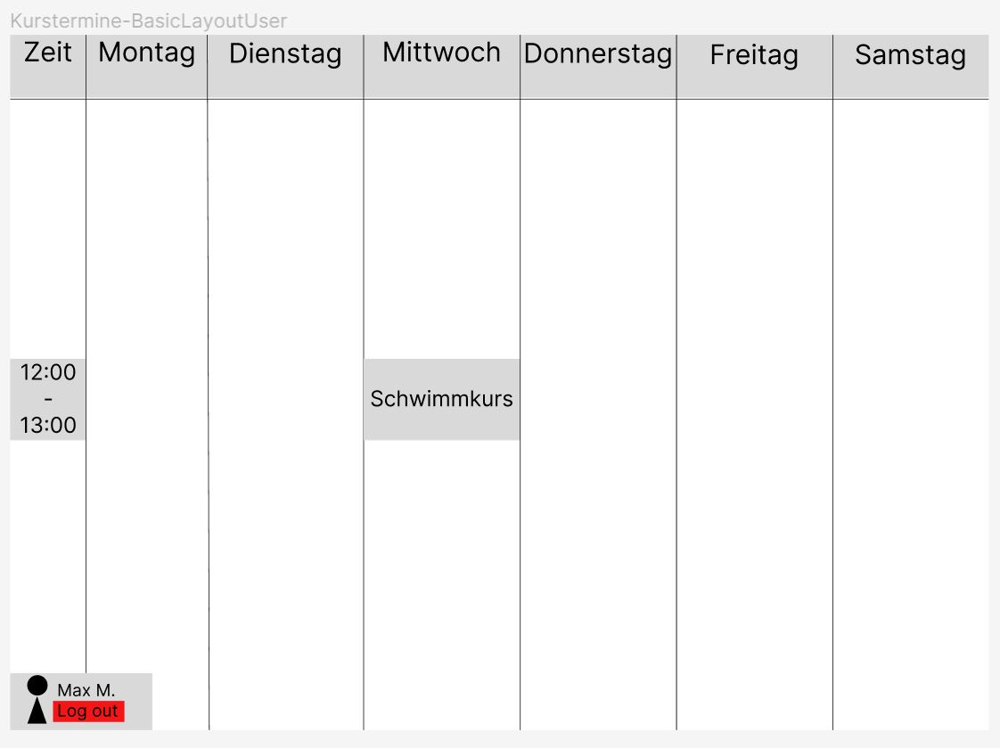
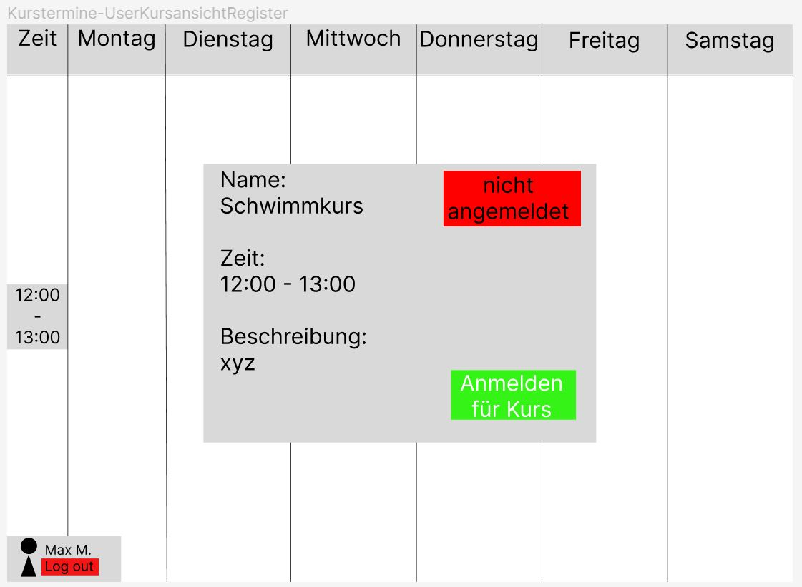
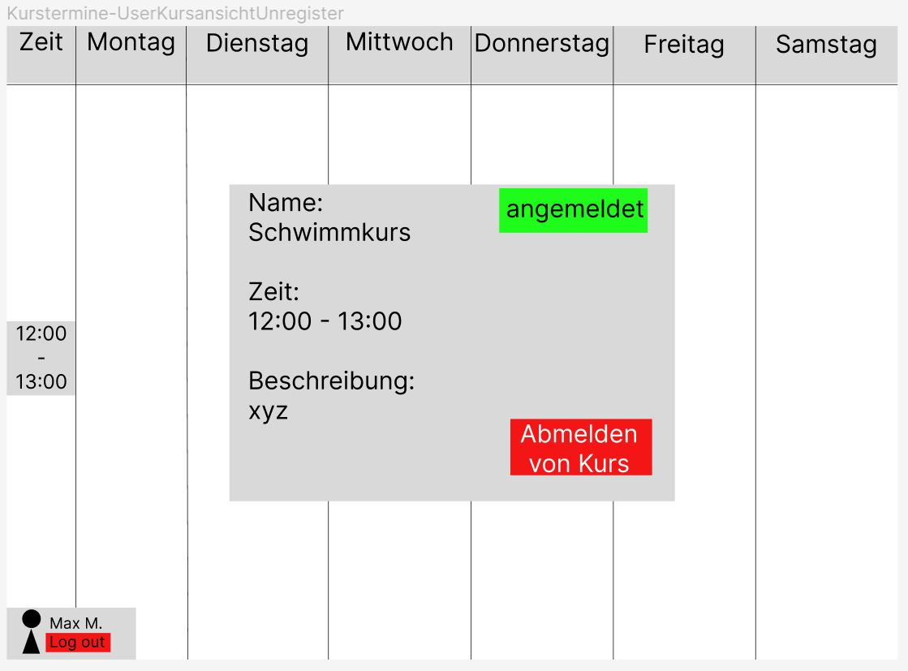

= Pflichtenheft Kurstermine
Ilming Winnie, Schludermann Julian, Schnalzenberger Arwed, Sonnleitner Lukas
:description: Projektantrag Kurstermine
:sectanchors:
:sectnums:
:url-repo: https://github.com/2223-3bhif-syp/02-projekte-kurstermine

Version: 1.1

Version Date: 22-01-2022

Authors:

* Ilming Winnie w.ilming@students.htl-leonding.ac.at
* Schludermann Julian j.schludermann@students.htl-leonding.ac.at
* Schnalzenberger Arwed a.schnalzenberger@students.htl-leonding.ac.at
* Sonnleitner Lukas l.sonnleitner@students.htl-leonding.ac.at

== Ausgangssituation
Die Akademie für körperliches Wohlbefinden bietet im Rahmen des Projekts "Sicherheit im Wasser" Baby, Kinder- und Erwachsenenschwimmkurse an.
Diese Kurse werden von Interessenten gebucht und sollen ihre Kenntnisse, um sich im Wasser adäquat bewegen zu können durch den häufigen Besuch der Einheiten erweitern.

== Ist-Zustand
Ein wichtiger Teil der Akademie für körperliches Wohlbefinden ist die Verwaltung von Teilnehmern.
Momentan wird diese größtenteils von einem externen Unternehmen übernommen.
So können sich Teilnehmer selbstständig in bestimmte Kurse einschreiben und sich auch wieder austragen.

== Problemstellung
Die Teilnehmer können nur auf Kursebene selbst agieren (In Kurs Einschreiben/Aus Kurs austragen).
Das an- und abmelden von einzelnen Terminen ist den Teilnehmern zurzeit nicht möglich.
So kann das Ziel, möglichst häufig zum Schwimmen in die Kurse zu kommen nur teilweise erreicht werden,
da durch diverse Abwesenheiten wie zum Beispiel Krankheiten oder sonstige Verhinderungen einige Plätze eines Termins ungenutzt bleiben.

== Aufgabenstellung
=== Funktionale Anforderungen
==== Use-case Diagramm
[plantuml,ucd,png]
----
include::plantuml/use-case-diagram.puml[]
----

* Termine eines Kurses einsehen
** Ein Teilnehmer eines Kurses kann alle Termine des Kurses in einer Übersicht einsehen
* Für einen Termin abmelden
** Ein Teilnehmer kann sich jederzeit von einem Termin eines Kurses abmelden. z.B. Teilnehmer ist krank
* Für einen Termin anmelden
** Ein Teilnehmer kann sich jederzeit für einen Termin eines Kurses anmelden.
* Kurse Verwalten
** Kurs anlegen
*** Der Administrator kann einen neuen Kurs anlegen, in den sich die Teilnehmer selbstständig einschreiben können
** Kurs entfernen
*** Der Administrator kann einen Kurs löschen sollte dieser nicht stattfinden

==== Domain Object Model des Systems
[plantuml,ucd,png]
----
include::plantuml/class-diagram.puml[]
----

=== GUI
* GUI für das Anmelden

.Anmeldeseite
[%collapsible]
====
image:images/KurstermineLoginPage.jpg[]
====

* GUI für das Registrieren

.Registrierungsseite
[%collapsible]
====

====

* Basic GUI für die Sicht des Admins

.Admin-Ansicht - Basic
[%collapsible]
====
image:images/KurstermineBasicLayoutAdmin.jpg[]
====

* GUI für das Erstellen eines Kurses als Admin

.Admin-Ansicht - Kurserstellung
[%collapsible]
====
image:images/KurstermineAdminKursansichtCreate.jpg[]
====

* GUI für das Bearbeiten eines Kurses als Admin

.Admin-Ansicht - Kursbearbeitung
[%collapsible]
====

====

* Basic GUI für die Sicht des Users

.User-Ansicht - Basic
[%collapsible]
====

====

* GUI zum Anmelden für einen Kurs als User

.User-Ansicht - Kursanmeldung
[%collapsible]
====

====

* GUI zum Abmelden für einen Kurs als User

.User-Ansicht - Kursabmeldung
[%collapsible]
====

====

=== Nicht-Funktionale Anforderungen
* Benutzbarkeitsanforderung
** Die Software soll für Personen aller altersgruppen leicht bedienbar sein.
** Jeglicher Text in der Applikation ist in einfacher und verständlicher Sprache geschrieben.

* Effizienzanforderung
** Das System soll innerhalb von 200ms einen neuen Kurs und dessen Termine angelegt haben.

* Wartbarkeits- und Portierbarkeitsanforderung
** Das System muss von den Entwicklern später nicht weiter bearbeitet werden.

* Sicherheitsanforderung
** Die Daten der Nutzer müssen so gut wie möglich vor Dritten geschützt werden.

* Gesetzliche Anforderung
** Bei der bearbeitung des Projekts muss keine spezielle Norm beachtet werden.

* Zuverlässigkeit
** Robustheit / Fehlertoleranz
*** Auch bei der Eingabe von ungültigen Werten und falschen Benutzung stützt das Programm nicht ab.

== Ziele
* Plätze der Termine vollständig nutzten.
* Umsatz steigern.

== Mengengerüst
* Benutzer (insgesamt)
** ca. 1000
* Gleichzeitig aktive Nutzer
** 50

== Rahmenbedingungen
* Programmiersprache: Java

== Lieferumfang
* Dokumentation
* Quellcode
